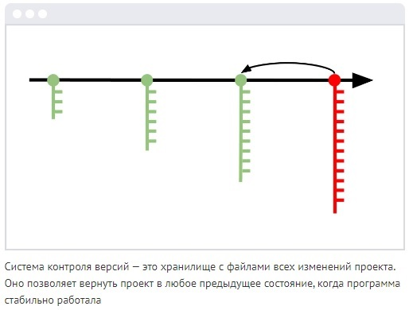
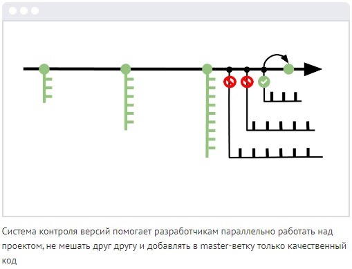
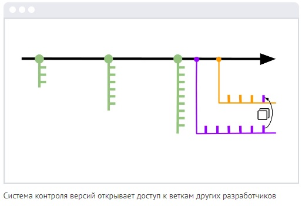

# Инструкция по работе с git
## Что это и для чего нужна система контроля версий?
**Git** — это система для управления версиями исходного кода программ.
В программировании за сохранение кода в контрольных точках отвечает *система контроля версий* — специальная технология, которую можно подключить к любому проекту. Система контроля версий страхует от ошибок и возвращает код в то состояние, когда всё работало.

**Git — это комплекс связанных веток.**

Коммиты располагаются на master-ветке — основной версии проекта, которая после завершения работы превратится в продукт. Система контроля версий позволяет создавать ответвления от master-ветки и экспериментировать с проектом, не мешая другим участникам команды.

**Git — это инструмент совместного создания кода**

Часто бывает так: разработчики отделяются от master-ветки и работают над частью проекта самостоятельно — например, чтобы протестировать дополнительные функции. Но не могут продолжить, пока кто-то из команды не допишет код. Система контроля версий позволяет не ждать обновления master-ветки и разрешает всем участникам команды свободно перемещаться между ветками других разработчиков для копирования нужных фрагментов кода.

**Git — это распределённая система версий**

Системы контроля версий бывают локальными, централизованными или распределёнными.
* Локальная система хранит файлы на одном устройстве.В локальной системе удобно работать с большими проектами, но сложно взаимодействовать с удалённой командой.
* Централизованная использует общий сервер. В централизованной системе налажена удалённая работа, но всё привязано к одному серверу. Любой сбой или взлом может повредить файлы проекта.
* Распределённая — общее облачное хранилище и локальные устройства участников команды. В распределённой системе налажена удалённая работа. Если с файлами основного репозитория что-то случится — проект легко восстановить из копии любого участника команды.

**Из-за удобства и гибкости распределённая система версий Git считается современным форматом. Это стандарт для большинства ИТ-команд.**

## **Установка git на ПК**

    1. Установка на Мас
    
        Существует несколько способов установки Git на Mac. Самый простой — установить Xcode Command Line Tools. В версии Mavericks (10.9) и выше вы можете добиться этого просто первый раз выполнив 'git' в терминале.

        $ git --version
        Если Git не установлен, вам будет предложено его установить.

        Если Вы хотите получить более актуальную версию, то можете воспользоваться бинарным установщиком. Установщик Git для OS X доступен для скачивания с сайта Git https://git-scm.com/download/mac.

    2. Установка на Linux
        Если вы хотите установить Git под Linux как бинарный пакет, это можно сделать, используя обычный менеджер пакетов вашего дистрибутива. Если у вас Fedora (или другой похожий дистрибутив, такой как RHEL или CentOS), можно воспользоваться dnf:
        $ sudo dnf install git-all

        Если же у вас дистрибутив, основанный на Debian, например, Ubuntu, попробуйте apt:
        $ sudo apt install git

        Чтобы воспользоваться дополнительными возможностями, посмотрите инструкцию по установке для нескольких различных разновидностей Unix на сайте Git https://git-scm.com/download/linux.

    3. Установка на Windows
        Для установки Git в Windows также имеется несколько способов. Официальная сборка доступна для скачивания на официальном сайте Git. Просто перейдите на страницу https://git-scm.com/download/win, и загрузка запустится автоматически. Обратите внимание, что это отдельный проект, называемый Git для Windows; для получения дополнительной информации о нём перейдите на https://gitforwindows.org.

        Для автоматической установки вы можете использовать пакет Git Chocolatey. Обратите внимание, что пакет Chocolatey поддерживается сообществом.

## Ссылки для установки git и VSCode на ПК.

<code>[https://code.visualstudio.com/](VSCode)
</code> - установка VisualStudioCode

<code>[https://git-scm.com/](Git)
</code> - установка Git

## **Первая настройка git**

*git config --global user.name "Your name", например von_Krolikoff* - **команда для ввода имени**

*git config --global user.email "Your mail", например milkbrother@yandex.ru* - **команда для ввода адреса электронной почты**

*git version" - **команда для получения сведений о версии Git**

## **Создание и базовая работа с локальным репозиторием**

## Что такое репозиторий и инструкция по созданию локальных репозиториев.

* Репозиторий - папка, действия в которой отслеживаются программой (операции выполняемые над репозиторием, индекс, описывающий расположение файлов, и хранилище, содержащее собственно файлы).

Для создания репозитория необходимо:
* создать новую папку, не содержащую репозиториев и не являющуюся частью другого репозитория.
* далее в терминале запускаем *git init* - команду для создания репозитория в выбранной папке в результате выполнения git init появляется скрытая папка .git

## **Базовая работа с локальным репозиторием - основные команды**

*git add* - **команда для добавления версионности (сохранения версии файла)**
После внесения изменений необходимо их "добавить", что и выполняется данной командой.

*git commit -m (message)* - **команда для фиксации изменений файла.**
Создание **коммита** - точки фиксации изменений, в дальнейшем, возможно переключение между созданными коммитами - переход от одной версии файла к другой. 

*git status* - **команда для просмотра изменений файла**

*git log* - **команда для вывода журнала сохранений.** С помощью данной команды можно просмотреть имеющиеся коммиты - сохраненные версии файла.

*git diff* - **команда для просмотра разницы между текущим файлом и закоммиченным файлом**

*git checkout (номер коммита, либо master)* - **команда для перемещения между коммитами, либо возврата к актуальной версии.**

## **Что такое ветки и для чего они нужны при работе с системой контроля версий.**

Система контроля версий позволяет создавать ответвления от master-ветки и экспериментировать с проектом, не мешая другим участникам команды. А также, позволяет не ждать обновления master-ветки и разрешает всем участникам команды свободно перемещаться между ветками других разработчиков для копирования нужных фрагментов кода. 

Ветки нужны для того, чтобы программисты могли вести совместную работу над проектом и не мешать друг другу при этом. При создании проекта, Git создает базовую ветку.

## Базовая работа с ветками в git.

*git branch branch_name* - **команда для создания ветки**

*git branch -d* - **команда удаления ветки**

*git merge branch_name* - **команда слияния веток**

*git log -graph* - **команда для просмотра всех веток**

## Работа с удалёнными репозиториями

Для того, чтобы внести вклад в какой-либо Git-проект, необходимо уметь работать с удалёнными репозиториями. Удалённые репозитории представляют собой версии вашего проекта, сохранённые в интернете или ещё где-то в сети. У вас может быть несколько удалённых репозиториев, каждый из которых может быть доступен для чтения или для чтения-записи. Взаимодействие с другими пользователями предполагает управление удалёнными репозиториями, а также отправку и получение данных из них. Управление репозиториями включает в себя как умение добавлять новые, так и умение удалять устаревшие репозитории, а также умение управлять различными удалёнными ветками, объявлять их отслеживаемыми или нет и так далее. 

## Просмотр удалённых репозиториев
Для того, чтобы просмотреть список настроенных удалённых репозиториев, вы можете запустить команду *git remote*. Она выведет названия доступных удалённых репозиториев. Если вы клонировали репозиторий, то увидите как минимум origin — имя по умолчанию, которое Git даёт серверу, с которого производилось клонирование.

Вы можете также указать ключ -v, чтобы просмотреть адреса для чтения и записи, привязанные к репозиторию: *git remote -v*

## Получение изменений из удалённого репозитория — Fetch и Pull

Как вы только что узнали, для получения данных из удалённых проектов, следует выполнить: *git fetch [remote_name]*. Данная команда связывается с указанным удалённым проектом и забирает все те данные проекта, которых у вас ещё нет. После того как вы выполнили команду, у вас должны появиться ссылки на все ветки из этого удалённого проекта, которые вы можете просмотреть или слить в любой момент.

Когда вы клонируете репозиторий, команда *clone* автоматически добавляет этот удалённый репозиторий под именем «origin». Таким образом, git fetch origin извлекает все наработки, отправленные на этот сервер после того, как вы его клонировали (или получили изменения с помощью fetch). Важно отметить, что команда git fetch забирает данные в ваш локальный репозиторий, но не сливает их с какими-либо вашими наработками и не модифицирует то, над чем вы работаете в данный момент. Вам необходимо вручную слить эти данные с вашими, когда вы будете готовы.

Команда *git pull* позволяет получить изменения из удалённой ветки и слить их со своей текущей. Выполнение git pull, как правило, извлекает (fetch) данные с сервера, с которого вы изначально клонировали, и автоматически пытается слить (merge) их с кодом, над которым вы в данный момент работаете.

## Отправка изменений в удаленный репозиторий (Push)

Когда вы хотите поделиться своими наработками, вам необходимо отправить их в удалённый репозиторий. Команда для этого действия: *git push (remote-name) (branch-name)*.
