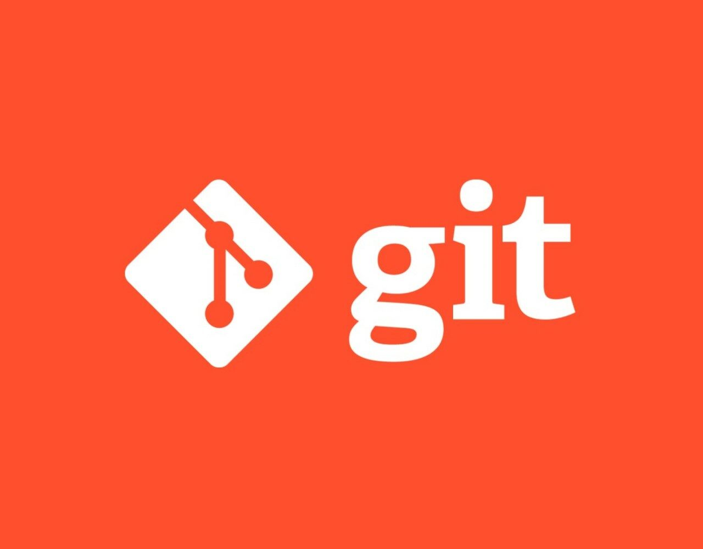

# Инструкция по работе с системой контроля версий Git #



!!! notice Базовые команды
**git init** - команда для создания локального репозитория

**git status** - команда для проверки статуса версионности репозитория

**git add** - команда для добавления версионности к файлам репозитория

**git commit -m "Comment"** - команда для добавления в репозиторий отслеживаемых файлов

**git diff** - команда для вывода различий между версиями

**git log** - команда для вызова журнала изменений

**git checkout (наименования commita)** - команда для перемещения по изменениям

---

!!! notice Команды при работе с конфигурацией Git

1. ```git config --global user.name "Tara Routray"``` - задает имя пользователя, которое будет использоваться в истории commit-ов и при авторизации в Git-репозитории

2. ```git config --global user.email "dev@tararoutray.com"``` - задает имя пользователя, которое будет использоваться при авторизации в Git-репозитории

---

!!! danger Команды для работы с удаленным репозиторием

**git clone `<url>`** - Создание копии удаленного репозитория на локальном

**git push** - Выгрузка изменений из локального в удаленный репозиторий

**git pull** - Вливание изменений в локальный репозиторий из удаленного

**git fetch** - забирает изменения удаленной ветки из репозитория по умолчания, основной ветки; той, которая была использована при клонировании репозитория. Изменения обновят удаленную ветку (remote tracking branch), после чего надо будет провести слияние с локальной ветку командой git merge.

> Для более подробной информации переходите по ссылке к оффициальной [документации](https://git-scm.com/docs/git)  