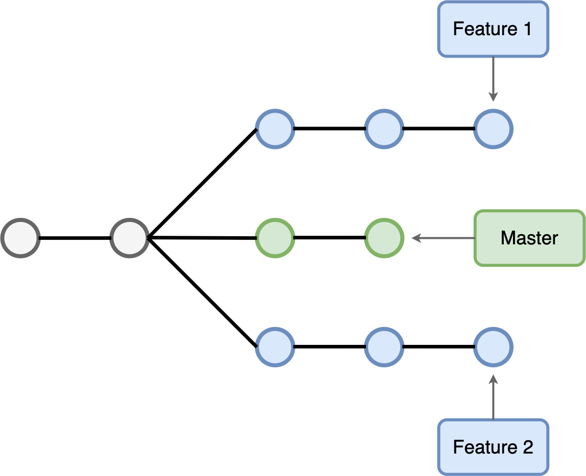

# Инструкция по работе с системой контроля версий GIT

## **Для установки системы контроля версий GIT, необходимо перейти по ссылке [GIT](https://git-scm.com/download/win)**

 ## После перехода по ссылке, необходимо нажать на _**иконку**_ 
## и после начала установки, следовать инструкциям.

## После установки необходимо «представиться» системе контроля версий. Это нужно сделать всего один раз, и git запомнит вас. Для этого нужно ввести в терминале 2 команды:
>git config --global user.name «Ваше имя англ буквами»

>git config --global user.email ваша_почта@example.com

### Для работы с приложением необходимо пользоваться специальными командами
(подробнее можно прочитать, перейдя по ссылке [Команды Git](https://git-scm.com/book/ru/v2/%D0%9F%D1%80%D0%B8%D0%BB%D0%BE%D0%B6%D0%B5%D0%BD%D0%B8%D0%B5-C%3A-%D0%9A%D0%BE%D0%BC%D0%B0%D0%BD%D0%B4%D1%8B-Git-%D0%9E%D1%81%D0%BD%D0%BE%D0%B2%D0%BD%D1%8B%D0%B5-%D0%BA%D0%BE%D0%BC%D0%B0%D0%BD%D0%B4%D1%8B))

### Ниже рассмотрим некоторые из них.

## Команды для работы с системой GIT

* *git init* - **команда для создания локального репозитория**

* *git status* - **команда для проверки статуса версионности репозитория**

* *git add* - **команда для добавления версионности к файлам репозитория**

* *git commit (-m "Сообщение")* - **команда для добавления в репозиторий отслеживаемых файлов**

* *git diff* - **команда для вывода различий между версиями**

* *git log* - **команда для показа журнала изменений**

* *git checkout (параметр)* - **команда для перемещения по изменениям** 

* *git reset* - **команда для отмены изменений**

* *git show* - **команда просмотра полного списока изменений, внесённых конкретным коммитом** 

* *git revert* - **команда, чтоб откатить последний коммит**

* *git help* - **команда для получения помощи**

* *git rm* - **команда для удаления файлов из индекса и рабочей директории**

* *git clean* - **команда для удаления мусора из рабочей директории**

## **Шпаргалка**

>Репозиторием называют хранилище вашего кода и историю его изменений.

1. <https://habr.com/ru/company/ruvds/blog/599929/>
2. <https://medium.com/@vvladislavv/%D1%88%D0%BF%D0%B0%D1%80%D0%B3%D0%B0%D0%BB%D0%BA%D0%B0-%D0%BF%D0%BE-%D0%BE%D1%81%D0%BD%D0%BE%D0%B2%D0%B0%D0%BC-git-github-dcd6b91406a8>
## Комманды для работы с ветвлениями

* *git branch* - **команда для просмотра веток репозитория**

* *git branch branch-name* — **команда для создания новой ветки**

* *git checkout branch-name* — **команда для переключения на указанную ветку и обновления рабочей директории**

* *git checkout -b branch-name* - **команда для создания и переключения на созданую ветку**

* *git checkout filename* — **команда для возврата файла в первоначальное состояние если он еще не был добавлен в индекс коммита**

* *git merge branch* — **команда для слияния изменения в текущей ветке с изменениями из заданной**

* *git branch -d branch* — **команда для удаления заданной ветки**

* *git branch -D branch* — **команда принудительно удалить заданную ветку, игнорируя ошибки**

* *git branch -m <oldname> <newname>* — **команда для переименования ветки**

* *git log --graph* - **команда для графического представления списка коммитов**

## Более подробно здесь *[Подсказки](https://agladky.ru/blog/git-cheat-sheet/)*

## Все рассмотренное выше касалось локальной работы с *gitом*, но его главное предназначение - командная работа. Иными словами, каждый пользователь, сидя на своем рабочем месте может работать над проектом, вносить изменения, дополнять и т.д., создавая отдельную часть проекта. Но как объединить все отдельно выполненые работы участников в один огромный, законченый проект. Для этого существует множество рессурсов, одним из которых является _**GitHub**_ 

### Откройте GitHub перейдя по ссылке **[GitHub](https://github.com/)**

### Необходимо зарегистрироваться на сайте, последовательно выполняя все шаги. По окончании регистрации можно пользоваться ресурсом.

## Для работы с _**GitHub**_ в **[GIT](https://git-scm.com/download/win)** существуют несколько команд

* *git clone* - **команда позволяет скопировать внешний репозиторий на ваш ПК**

* *git push* - **команда позволяет отправить нашу версию репозитория на внешний репозиторий.**

* *git pull* - **команда  позволяет скачать все из текущего репозитория и автоматически
сделать merge с нашей версией**  

## Работа с удаленными репозиториями в git

### Зачастую, работа происходит итеративно, необходимо очень часто скачивать уже созданые репозитории других пользователей, вносить в них изменения и снова загружать на GitHub, используя pull request.

### Как сделать pull request

1. Делаем fork репозитория в свой профиль на GitHub.

2. Делаем clone СВОЕЙ версии репозитория, нажав на кнопку **Code** и скопировав **HTTPS**, набираем команду в **git**

3. Создаем новую ветку и в нее вносим свои изменения

4. Фиксируем изменения (делаем коммиты)

5. Отправляем свою версию в свой GitHub

6. На сайте GitHub нажимаем кнопку pull request 

## Вот краткая и очень содержательная инструкция по работе с контролем версий.