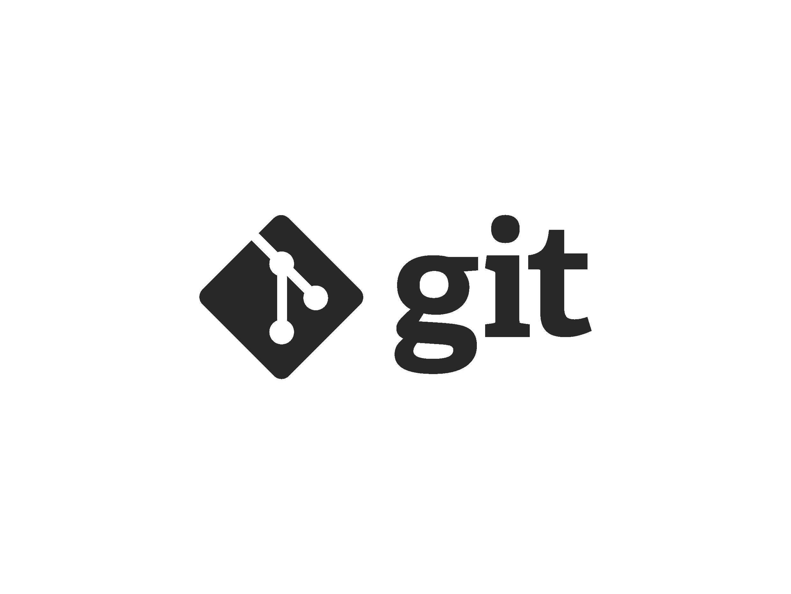

# Инструкция по работе в системе контроля версий Git

## Основные команды

> * **git add** добавляет содержимое рабочего каталога в индекс для последующего коммита.
>> * __git status__ показывает состояния файлов в рабочем каталоге и индексе: какие файлы изменены, но не добавлены в индекс; какие ожидают коммита в индексе.
>>> * _*git diff*_ используется для вычисления разницы между любыми двумя Git деревьями.
1. **git commit** берёт все данные, добавленные в индекс с помощью git add, и сохраняет их слепок во внутренней базе данных, а затем сдвигает указатель текущей ветки на этот слепок.
2. **git log** для просмотра истории предыдущих коммитов в обратном хронологическом порядке можно использовать эту команду.
3. __git reset__, как можно догадаться из названия, используется в основном для отмены изменений.
4. _git rm_ используется в Git для удаления файлов из индекса и рабочей копии.
5. ***git clean*** используется для удаления мусора из рабочего каталога.

# Команды по ветвлению и слиянию

* **git branch** — это своего рода “менеджер веток”. Она умеет перечислять ваши ветки, создавать новые, удалять и переименовывать их.
* __git checkout__ используется для переключения веток и выгрузки их содержимого в рабочую директорию.

---------------------------------------------

* _git merge_ используется для слияния одной или нескольких веток в текущую. Затем она устанавливает указатель текущей ветки на результирующий коммит.
* _*git mergetool*_ просто вызывает внешнюю программу слияний, в случае если у вас возникли проблемы слияния.

**********************************************

* **git stash** используется для временного сохранения всех незакоммиченных изменений для очистки рабочей директории без необходимости коммитить незавершённую работу в новую ветку.
* ***git tag*** используется для задания постоянной метки на какой-либо момент в истории проекта. Обычно она используется для релизов.

 [ссылка](https://gist.github.com/Jekins/2bf2d0638163f1294637#Blockquotes/)

# Команды по совместной работе и обновлению проектов

> * **git pull** работает как комбинация команд git fetch и git merge, т.е. Git вначале забирает изменения из указанного удалённого репозитория, а затем пытается слить их с текущей веткой.
* **git push** используется для установления связи с удалённым репозиторием, вычисления локальных изменений отсутствующих в нём, и собственно их передачи в вышеупомянутый репозиторий. Этой команде нужно право на запись в репозиторий, поэтому она использует аутентификацию.
> * __git fetch__ — получает данные из ветки заданного репозитория, но не сливает изменения.
* **git remote** служит для управления списком удалённых репозиториев. Она позволяет сохранять длинные URL репозиториев в виде понятных коротких строк, например "origin", так что вам не придётся забивать голову всякой ерундой и набирать её каждый раз для связи с сервером. Вы можете использовать несколько удалённых репозиториев для работы и git remote поможет добавлять, изменять и удалять их.
> * **git archive** используется для упаковки в архив указанных коммитов или всего репозитория.