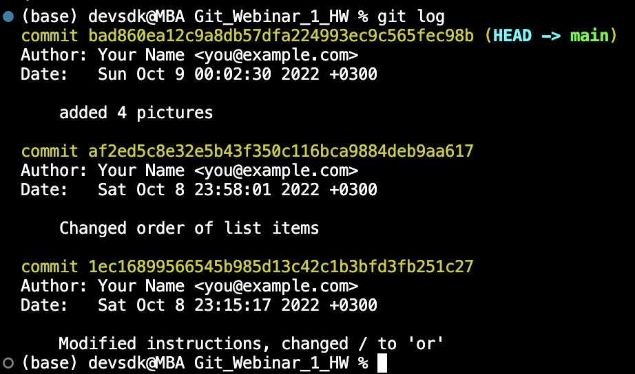

# Репозиторий для пул реквестов

# Инструкция по работе с системой

## __Инструкция по начальным командам в GIT__

*Git init* - **команда инициализации репозитория локально**

*Gid add* - **Команда для добавления измениений или файла в отслеживание**

*git commit -m "some message"* - **команда для закрепления изменений в репозитории**

*Git log* - **команда для вывода журнала изменений**

*Git status* - **команда для просмотра локальный изменений**

*Git diff* - **команда для просмотра различий между изменениями**

*Git checkout* - **команда для перемещения между коммитами**

## __Команды для работы с ветвлением__

*git branch* - __команда для вывода списка веток__

*git branch branch_name* - __команда для создания новой ветки__

*git checkout branch_name* - __команда для переключения между ветками__

*git checkout -b branch_name* - __создание новой ветки и переход нан нее__

*git merge branch_name* - __слить ветки__

*git branch -d branch_name* - __удалить ветку__

## __Команды для работы с удаленым репозиторием__

__*Удалённый репозиторий — это репозиторий, который хранится в интернете или ещё где-то в сети*__

*git clone <ссылка>* - __Создание копии удаленного репозитория на локальном__

*git push* - __Выгрузка изменений из локального в удаленный репозиторий__

*git pull* - _Вливание изменений в локальный репозиторий из удаленного__

*cd <имя_папки>* - __Переход между папками__

*mkdir <имя_папки>* - __Создания папки из терминала__

*pull request* - __Запрос на вливание изменений из локального репозитория в основную ветку исходного репозитория. Таким образом они попадут к владельцу проекта__

### __Работа с изображениями__

** - __Чтобы вставить изображение, вначеле ставим (!) затем в квадратных скобках ( [] ) пимет текст изображение и в круглых скобках ( () ) пишем имя файла, предварительно загрузить его в папку локального репозитория.__

Пример  

#### __Работа с цитатами__

Чтобы вставить цитату нужно в начале текста поставить (> )

> Цитата (уровень 1)    
> > Вложенная цитата (уровень 2)    
> > > Вложенная цитата (уровень 3)    

> > Продолжение цитаты (уровень 2)    

> Продолжение цитаты (уровень 1)  

#### __Добавление ссылок__

*Либо просто вставить ссылку, либо дополнительно задать текст ссылки (пробела между скобками быть не должно)*:

*Первый вариант вставки ссылок* - __это просто написать адрес сайта__ https://gb.ru/courses/1117

*Второй вариант записывается так*: [текст ссылки](адрес ссылки)

[Git.Базовый курс](https://gb.ru/courses/1117)