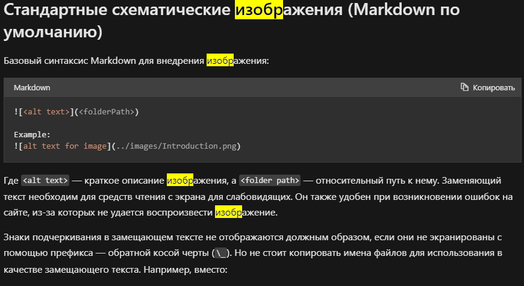

# Инструкция по работе с Git

# Базовые команды

*git commit -m "<message>"* - **Команда для создания коммита**

*git diff* - **Команда для вывода разницы между зафиксированным и нынешним файлом**

*git log* - **Команда для выводв журнала изменений**

*git checkout <commit code>* - **Команда для перехода к коммиту по его хэш коду**

*git checkout main* - **Команда для взврата на актуальное состояние**

## Команлды для ветвления

*git branch* - **вывести список всех веток на экран**

*git branch new_branch_name* - **Создаем новую ветку с именем new_branch_name**

*git checkout -b branch_name* - **Переход на ветку branch_name**

*git merge branch_name* - **Сливаем ветку  branch_name с текущей веткой** 

*git checkout -m branch_name* - **переименовать ветку**

*git log --graph* - **Команда для вывода в графичееском режиме** 

# Работа с Markdown

*__Markdown__* - Облегчённый язык разметки, созданный с целью обозначения форматирования в простом тексте, с максимальным сохранением его читаемости человеком, и пригодный для машинного преобразования в языки для продвинутых публикаций.

- Вставка GIF

## Вставка изображения 

-  Вставка изображения

## Ссылки
- Справочник по Markdown от Microsoft - [ссылка](https://learn.microsoft.com/ru-ru/contribute/markdown-reference)

*git clone (+ссылка)* - **позволяет склонировать внешний репозиторий на наш ПК**

- git pull
    
    позволяет скачать все из текущего репозитория и автоматически
    сделать merge с нашей версией

- git push
    
    позволяет отправить нашу версию репозитория на внешний
    репозиторий. ТРЕБУЕТ АВТОРИЗАЦИИ на внешнем репозитории
