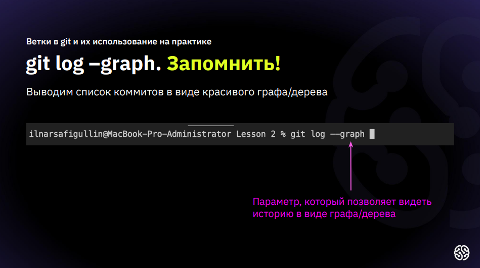

# Инструкция по работе с Git

## Базовые команды Git

*git init* - **Создание нового локального репозитория**

*git status* - **Команда до статуса изменений**

*git add* - **Команда для добавления файла к коммиту**

*Git commit -m "message"* - **Команда для создания коммита**

*git diff* - **Команда для вывода разницы между зафиксированым и нынешним файлом**

*git log* - **Команда для вывода журнала изменений**

*git checkout <commit code>* - **Команда для прерхода к комиту по его хэш коду**

*git checout master(main)* -**Команда для возврата на актуальное состояние**

*git clone* — **создание копии удаленного репозитория**

*git pull* — **скачиваем копию из удаленного репозитория**

*git push* — **вносим изменения в удаленный репозиторий**

**Цитата** 
> В анкете, которую я заполняла перед операцией, был вопрос: кому позвонить в случае крайней необходимости.... Я написала: более квалифицированному хирургу
>> *Михаил Жванецкий*

**Цитата в списке**
1. Элемент списка с цитатой:
    > Это цитата
    > внутри элемента списка.
2. Второй элемент списка

**Упорядоченный список**
 1. Создать план на сегодня
 2. Выполнить 1-й пунк
 3. Осознать что первые два пунка уже сделаны
 4. Отдохнуть от проделаной работы

**Не упорядоченный список**

*Крабовый салат*

* Рис 
* Крабовые палки
* Консервированная кукуруза
* Соленые огурцы
* Майонез
# _**Ссылки**_

- [Ссылка внутритекстовая](http://example.com/ "Подсказка при наведении")

- <http://example.com/>

**Изображение**

