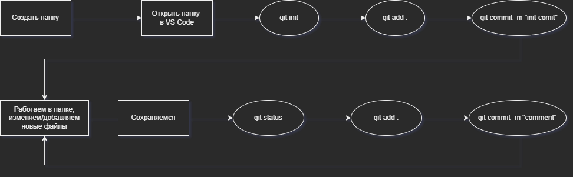

# Инструкция по работе с Git
## Базовые команды
| Синтаксис| Описание|
| :---| :---|
| *git --version*| Версия системы Git|
| *git config --global user.name «Ваше имя английскими буквами»*| Ввод имени в систему|
| *git config --global user.email ваша почта@example.com*| Ввод электронной почты в систему|
| *git init*| Инициализация локального репозитория|
| *git status*| Вывод состояния системы на данный момент|
| *git add*| Добавление версионности файлу|
| *git commit -m <Some_message>*| Добавление файлов к комиту(сохранению)|
| *git diff*| Команда для вывода разницы между последним коммитом и текущими изменениями|
| *git log*| Вывод списка комитов в хронологическом порядке|
| *git checkout <хэш-номер коммита или master>*| Переключение между версиями|

## Создание/редактирование репозитория
>
>
>В вверхней части - создание репозитория. 
>
>В нижней части - порядок действий при редактировании репозитория

Крайне рекомендуется перед выполнением каждого действия с репозиторием использовать `git status`. С помощью такого подхода мы кратно уменьшаем вероятность ошибки при работе с git.

Рассмотрим несколько статусов:
*  Файл изменён, но при команде `git status`, терминал не     находит изменений
    >    nothing to commit, working tree clean
 
    Изменения не сохранены -> *`CTRL+S`*

*   После сохранения терминал подсвечивает изменённые файлы красным
    >Changes not staged for commit:
    >
    > modified: *filename*
    
    Изменния не добавлены в версию -> `git add` *`filename`*
*   После добавления изменений в версию терминал подсвечивает добавленные файлы зелёным
    >Changes to be commited:
    >
    > modified: *filename*
    
    Версия готова к релизу -> `git commit -m "`*`comment`*`"`  
    
---
## Ветвление версий
| Синтаксис| Описание|
| :---| :---|
| *git branch*| Вывод списка веток|
| *git branch <branch_name>*| Создание новой ветки|
| *git checkout -b <branch_name>*| Создание новой ветки (если не существует) и переход в неё|
| *git checkout <branch_name>*| Переключение на другую ветку|
| *git merge <branch_name>*| Слияние новых веток (в ветку, в которой мы находимся добавляются изменения из ветки, которую мы вводим) |
| *git branch -d <branch_name>*| удаление ветки|
| *git log --graph*| графическое отображение коммитов в ветках|

### Решение конфликтов
При работе в двух ветках одновременно может возникнуть ситуация, когда в одной и другой редактировались одинаковые строки. При попытке слить эти ветки Git обозначит конфликт и предложит его решить.

При возникновении конфликта VS Code предложит следующие варианты:

1. Внести все изменения из основной ветки
2. Внести все изменения из вспомогательной ветки
3. Внести все изменения из обеих веток
4. Рассмотеть каждый случай отдельно 

## Работа с удалёнными репозиториями

| Синтаксис| Описание|
| :---| :---|
| *git clone <repo_adress>*| Клонирование удалённого репозитория на ПК|
| *git pull*| Передача данных с удалённого репозитория в локальный и слияние с ним|
| *git push*| Передача с локального репозитория в удалённый и слияние с ним|

### Настройка совместной работы

1. Зарегистрироваться в GitHub
2. Создать удалённый репозиторий
3. Создать локальный репозиторий
4. Связать репозитории
    > GitHub подскажет 😉 
5. ???
6. `git push`
7. ????
8. `git pull`

### Pull request

В больших компаниях один ответственный за проект создает аккаунт. Другие пользователи дают команду pull request. Предлагать изменения на GitHub нужно в отдельной ветке. Сначала пользователь копирует репозиторий на свой компьютер, делает fork репозитория, затем клонирует версию на своём ПК, создаёт ветку с предлагаемыми изменениями, отправляет изменения командой push в свой аккаунт на GitHub и даёт команду pull request. 

### Порядок действий для внесения изменений в проект на GitHub
create fork --> `git clone` --> `???` --> `git push` --> pull request