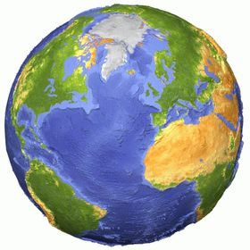

# Дополненная инструкция для домашнего пользования 

## Инструкция по работе с Git
## Базовые команды по работе с Git

## Новые команды Git

*git init* - **Создание нового локального репозитория**

*git status* - **Команда для вывода статуса изменений**

*git add* - **Команда для добавления файла к коммиту**

*git commit -m "message"* - **Команда для создания коммита**

*git diff* - **Команда для вывода разницы между зафиксированным и нынешним файлом**

*git log* - **Команда для вывода журнала изменений**

*git checkout <commitcode>* - **Команда для перехода к коммиту по его хэштегу**

*git checkout master* - **Команда для возврата к актуальному состоянию**

>С помощью знака ">" можно добавить цитату

Цитаты можно вложить друг в друга. Например:

>Это цитата.
>
>>А это вложенная цитата.
>
>И снова первый уровень цитирования.

*Для создания ссылки надо внутри круглых скобок расположить URL ссылку, а перед этим текст ссылки заключенный в квадратных скобках* - [ЖМИ](https://gb.ru/)

*С помощью языка Markdown можно добавлять изображения - для этого необходимо в квадратных скобках расположить текст к изоражению, а в круглых скобках заключить путь к изображению и перед этим всем поставить восклицательный знак* - 

Также можно добавлять картинки меньше размера

*Также можно добавлять нумерованные списки*
1. Это первая строчка нумерованного списка
2. Это вторая строчка нумерованного списка

*Чтобы создать стандартную таблицу с заголовком, вставьте пунктирную линию после строки*

|Заголовок|моей|таблицы|
|:---------|----:|:-------:|
|Столбец1 |Столбец2|Столбец3|
|Столбец1 |Столбец2|Столбец3|

## Команды для удаленного репозитория

*git clone <ссылка на репо>* - **скачать удаленный репозиторий**

*git push* - **отправить изменения на удаленный репозиторий**

*git pull* - **скачать изменения с удаленного репозитория**

*git push -u origin <название ветки>*