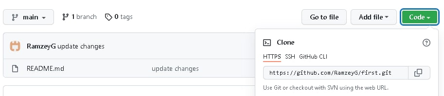

# Инструкция по работе с Git

## 1. Введение

Прежде чем использовать Git, вы должны установить его на своём компьютере.
Скачать Git можно [тут](https://git-scm.com/book/ru/v2/%D0%92%D0%B2%D0%B5%D0%B4%D0%B5%D0%BD%D0%B8%D0%B5-%D0%A3%D1%81%D1%82%D0%B0%D0%BD%D0%BE%D0%B2%D0%BA%D0%B0-Git) 
Следуйте инструкциям по установке в соответствии с вашей операционной системой.

После установки, Git можно использовать как отдельную программу, работая из командной строки. Однако удобнее пользоваться средой разработки например VScode, скачать и установить ее можно [тут](https://code.visualstudio.com/download)

## 2. *Git* первый запуск

 * После установки необходимо «представиться» системе контроля версий.
  
 * Для этого нужно ввести в терминале 2 команды:  
  *`git config --global user.name «Ваше имя англ буквами»`*
  
    *`git config --global user.email ваша_почта@example.com`*
  

  * Следущим пунктом создаем папку с проектом, открываем ее в **VScode**
  
  * Основное взаимодействие с **Git** происходит через ввод команд, поэтому запускаем терминал

  * для того чтобы **Git** начал отслеживать состояние проекта вводим команду: *`git init`*

## 3. *Git* начало работы

- В папке с проектом создаем файл

- для сохранения изменений в содержании файла используем сочетание клавиш *`Ctrl + S`*

- чтобы зафиксировать изменения в *Git* вводим команду: *`git add .\<Название файла>`*
  * *`git add .\`* - добавит все файлы к следующему коммиту, удобно при работе с одним файлом в директории

- далее нужно создать коммит - точку восстановления, команда: *`git commit -m "коментарий"`*
   * *`git commit -am “message”`* - выполнит команду add и сразу сделает коммит  

- чтобы вывести информацию о текущем статусе файлов проекта можно ввести команду: *`git status`*

- чтобы вывести список всех созданных коммитов используется команда: *`git log`*
   * *`git log --all`* - выведет историю всех коммитов на всех ветках
   * *`git log --oneline`* - выведет список коммитов в коротком виде, удобдно сочетается с предыдущей командой

-  чтобы увидеть увидеть разницу между текущим файлом и закоммиченным файлом введите команду *`git diff`*

- для перехода к любому из коммитов используется команда: *`git checkout <первые 4 цифры номера коммита>`*. Номер коммита мы можем узнать из списка коммитов

- чтобы вернуться к актуальной версии можно ввести команду: *`git checkout master`*

## 4. Работа с ветвлением в Git

 - *`git branch`* - **команда для вывода всех веток на экран**

 - *`git branch <название ветки>`* - **команда для создания новой ветки**
   -  *`git branch -m <название ветки>`* - **Переименует текущую ветку**

 - *`git checkout <название ветки>`* - **команда для переключения между ветками**
   - *`git checkout -b <название ветки>`* - **создаст новую ветку и автоматически перейдет в нее**

 - *`git branch -d <название ветки>`* - **команда для удаления ветки**

 - *`git merge <название ветки>`* - **команда для слияния веток**

 - *`git log --graph`* - **команда для вывода истории коммитов с визуализацией**
 

 ## 5. Работа с удаленным репозиторием
  Для работы с удаленным репозиторием для начала желательно этот репозиторий завести, например зарегистрироваться тут - [GitHub](https://github.com/)
  Также стоит отметить что можно проводить работу не только с вашим личным репозиторием но и предлагать изменения в репозитории других людей
  1. Чтобы начать работу с вашим удаленным репозиторием:
     * надо создать отдельную папку на локальном компьютере и открыть ее с помощью редактора кода
     * далее инициализировать *Git* в папке командой - `git init`
     * затем необходимо на вашей странице [GitHub](https://github.com/) открыть вкладку Repositories и нажать зеленую кнопку New
     
     * далее на открывшейся странице нажимаем зеленую кнопку Code, и копируем строку на вкладке HTTPS
     
     * и наконец выполняем команду *`git remote <наша скопированная ссылка>`*
     таким образом мы связываем наш локальный репозиторий и удаленный репозиторий c 
     * далее работаем в редакторе кода, вносим изменения, создаем файлы, делаем коммиты, но это все сохраняется на локальном компьютере
  
     * Для отправки внесенных изменений на сервер используется команда *`git push`* , только после нее изменения сделанные на вашем компьютере попадут в удаленный репозиторий
     * Бывает и так что изменения в удаленный репозиторий внесены вами с другой машины, и на текущей у вас и нет. Команда *`git pull`* - заберет последние изменения из удаленного репозитория в локальный

     * В случае когда у вас на машине нет вашего проекта, а поработать с ним надо сейчас, можно выполнить команду: *`git clone <ссылка скопированная из репозитория на GitHub>`* - создаст копию удаленного репозитория в локальной папке

  2. Кроме работы с вашим личным репозиторием можно предлагать\вносить изменения в чужие репозитории
     * Создаем ***`Отдельную папку`*** на нашем компьютере
       * Очень вашно создавать ***`Отдельную папку`*** для каждого проекта
       * Это поможет избежать попадания лишних файлов ваш проект
       * Кроме того следите за тем чтобы не создавать ***`Отдельную папку`*** в репозитории с инициализированным *`Git`*, чтобы не "сломать" какой то другой проект
    
     * Открываем необходимый репозиторий на [GitHub](https://github.com/)
     * В правом верхнем углу экрана находим и нажимаем кнопку Fork, после чего произойдет копирование(Fork) репозитория другого человека на вашу страницу.
     
     * после нажатия кнопки Fork репозиторий откроется на вашей странице, необходимо взять ссылку на него как мы делали ранее нажав кнопку Code
     
     * Открываем нашу ***`Отдельную папку`*** с помощью *`Vscode`* и запускаем терминал
     * Выполняем уже знакомую нам команду *`git clone <ссылка скопированная из репозитория на GitHub>`*
     * Ура! Теперь копия репозитория есть на вашем компьютере и мы можем в нем работать
       * ***`ВАЖНО!!!`*** Первой командой в терминале после получения репозитория сделайте отдельную ветку *`git branch <branch_name>`*
       * это и пример хорошего тона и позволит оставить у себя *`чистую/начальную`* версию проекта, к которой всегда можно будет вернуться
     * После того как мы накодили и внесли все желаемые изменения в проект, необходимо отправить его на сервер командой: *`git push`*
     * теперь у нас есть *`наша`* версия проекта на *`нашем`*  [GitHub](https://github.com/)
     * чтобы отправить\предложить наши изменения в репозиторий автора необходимо открыть наш репозиторий на [GitHub](https://github.com/), перейти во вкладку *`Pull requests`* и нажать зеленую кнопку *`New pull request`*