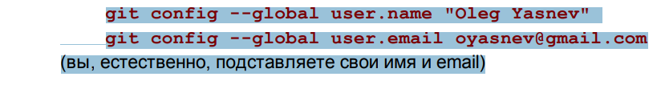

# Инструкция для работы с GIT

## Что такое Git и зачем он нужен?
>Git - это консольная утилита, для отслеживания и ведения истории изменения файлов, в вашем проекте. Чаще всего его используют для кода, но можно и для других файлов. Например, для картинок - полезно для дизайнеров.

## Начальные настройки и установки

*git config --global user.name «Ваше имя английскими буквами»  например: Konstantin*

*git config --global user.email ваша почта@example.com*

вот так:

*git init* – **инициализация локального репозитория**

*git status* – **получить информацию от git о его текущем состоянии**

*git add* – **добавить файл или файлы к следующему коммиту**

*git commit -m “message”* – **создание коммита**.

*git log* – **вывод на экран истории всех коммитов с их хеш-кодами**

*git checkout* – **переход от одного коммита к другому**

*git checkout* master – **вернуться к актуальному состоянию и продолжить работу**

*git diff* – **увидеть разницу между текущим файлом и закоммиченным файлом**
## Работа с ветками

*git branch* – **посмотреть список веток в репозитории**

*git branch <название ветки>* – **создать новую ветку**

*git checkout <название ветки>* – **переход к другой ветке**

*git checkout -b <название ветки>* – **переход к новой созданной ветке**

*git branch -d <название ветки>* – **удалить ветку**

*git merge <branch_name>* - **слияние веток**

## Работа с удаленными репо

*git clone* – **клонирование удаленного репозитория на локальный компьютер**

*git push* – **выгрузить изменения на удаленный репозиторий**

*git pull* - **стянуть изменения на удаленный репозиторий**

## Полная Инструкция

C более полной инструкцией вы можете ознакомиться [здесь](http://bioinformaticsinstitute.ru/sites/default/files/instrukciya_po_ispolzovaniyu_git_dlya_nachinayushchih.pdf)