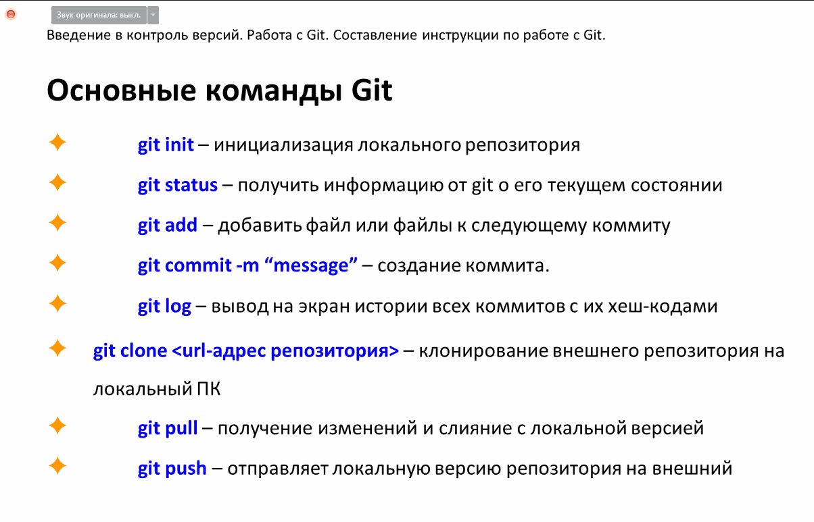

# Инструкция по GIT 

## Содержание:
### 1. Начало работы с GIT
### 2. Работа с коммитами
### 3. Работа с ветками
### 4. Работа с удаленными репозиториями.
### 5. Вспомогательная литература

***

## Начало работы с GIT

Скачать Git можно по [ссылке](https://git-scm.com/)

При первом использовании Git необходимо представиться. Для этого нужно ввести 2 команды в терминале:

>1. ***git config --global user.name "Ваше имя английскими буквами"*** - для представления системе контроля версий.

>2. ***git config --global user.email "Ваша почта@example.com"*** - для указания своей электронной почты.

Команда позволяющая посмотреть версию Git:

>***git --version***

Команда позволяющая инициализировать пустой репозиторий:

>***git init***

Команда позволяющая просмотреть текущие изменения:

>***git status***

***

## Работа с коммитами

Для того что бы добавить коммит необходимо показать Git-у какой файл мы хотим закомитить, за это отвечает команда: 

>***git add "Название файла"***

После этого необходимо внести сам коммит, для этого нужно ввести команду:

>***git commit -m "Текст коммита"***

Для того что бы вывести историю коммитов в хронологическом порядке необходимо использовать команду:

>***git log***

Для того что бы посомтреть разницу между текущей и предыдущей версией необходимо использовать команду:

>***git diff***

Для того что бы вернуться к любому комиту который мы сделали, можно воспользоваться командой:

>***git checkout "номер коммита"***

Для перемещения к последнему комиту можно воспользоваться командой:

>***git checkout master***

***

## Работа с ветками

Для того что бы посмотреть все существующие ветки можно воспользоваться командой:

>***git branch***

Для того что бы создать параллельную ветку мы можем использовать команду:

>***git branch (name)***

Для того что бы перемещаться между ветками мы можем использовать команду:

>***git checkout (name)***

Если мы хотим удалить одну из существующих веток то мы можем воспользоваться командой:

>***git branch -d (name)***

Если мы хотим слить ветку в текущую ветку то можно использовать команду:

>***git merge (name)***

Если мы хотим отменить процесс сливания веток можно использовать команду:

>***git merge --abort***

Если мы хотим посмотреть историю коммитов с визуализацией то можно использовать команду:

>***git log --graph***

***

## Работа с удаленными репозиториями

Если мы хотим скопировать удаленный репозиторий то можем воспользоваться командой:

>***git clone***

Если мы хотим отправить изменения на удаленный днпозиторий то можно воспользоваться командой:

>***git push***

Если мы хотим скачать изменения с удаленного репозитория то можно воспользоваться командой:

>***git pul***

***

## Вспомогательная литература

В текущей работе использовались дополнительные источники:

* [Введение в Git: от установки до основных команд](https://tproger.ru/translations/beginner-git-cheatsheet/#part4)
* [Краткое руководство по Маркдауну](https://paulradzkov.com/2014/markdown_cheatsheet/)
* [Введение в контроль версий (семинары)](https://gb.ru/lessons/234458)
* [~~Собственные знания которых бесконечное множество~~]()

## И конечно же
* 

