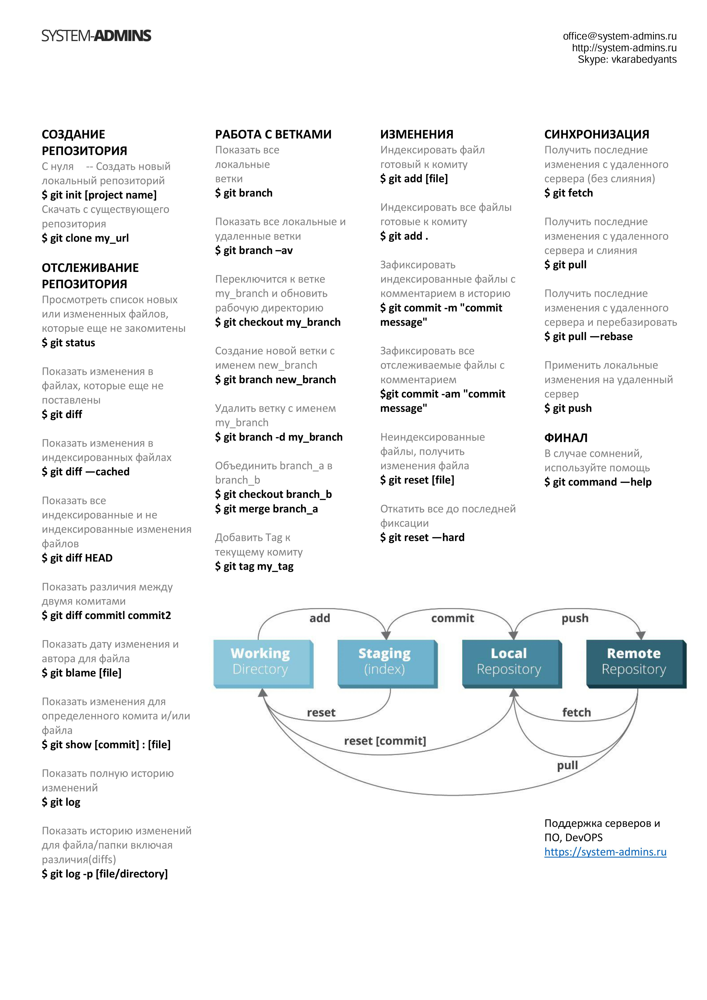

>Git - это консольная утилита, для отслеживания и ведения истории изменения файлов, в вашем проекте

>С помощью Git-a вы можете откатить свой проект до более старой версии, сравнивать, анализировать или сливать свои изменения в репозиторий.

## Начальная работа с системой констроля версий 

*git --version* - **Команда для проверки версий Git**

*git config --global user.name "Ваше имя английскими буквами"* - **например: Alyna**

*git config --global user.email* - **ваша почта@example.com**

*git init* - __Инициализируем пустой репозиторий__ 

*git status* - **Проверяем текущее состояние файлов** 

*git add* - **Добавляем версионность файлу**

*git commit -m "Message"* - **Команда для фиксации изменения файла**

*git log* -  **Вывод истории коммитов в хронологическом порядке**

*git diff* - **Вывод изменений на текущий момент по отношению к последнему коммиту**

*git checkout (master либо хэш-номер комита)* - **Переход между изменениями либо возврат к текущему состоянию**

*git branch* - **Вывод списка веток**

*git branch наименование_ветки* - **Создание новой ветки**

*git checkout наименование_ветки* - **Переход на ветку**

*git merge наименование_ветки_для_слияния_с_текущей* -  **Слияние ветки с текущей**

*git branch -d наименовние_ветки* - **Удаление ветки**

*git log --graph* - **Отображение дерева коммитов**

  ## Работа с удаленными репозиториями

  *git clone адресс_репозитория* - **Копирование удаленного репозитория в локальный репозиторий. Адресс репозитория можно получить, нажав на большую зеленую кнопку Code на странице репозитория на GitHub**

  *git pull* - **Команда позволяет скачать все из текущего репозитория и автоматически сделать merge с нашей версией**

  *git push* - **Команда позволяет отправить нашу версию репозитория на внешний репозиторий. ТРЕБУЕТ АВТОРИЗАЦИИ на внешнем репозитории**

  **Как настроить совместную работу git и GitHub:**

1. Создать аккаунт на GitHub.com
2. Создать локальный репозиторий
3. “Подружить” ваш локальный и удалённый репозитории. 
GitHub при создании нового репозитория подскажет, как это можно сделать
4. Отправить (push) ваш локальный репозиторий в удалённый (на GitHub), при этом, возможно, 

вам нужно будет авторизоваться на удалённом репозитории
5. Провести изменения “с другого компьютера”
6. Выкачать (pull) актуальное состояние из удалённого репозитория

*pull request* - **Предложение изменения кода в чужом репозитории**

**Как сделать pull request:**
1. Делаем   (ответвление) репозитория fork
2. Делаем git clone   версии репозитория СВОЕЙ
3. Создаем новую ветку и в НЕЕ вносим свои изменения
4. Фиксируем изменения (делаем коммиты)
5. Отправляем свою версию в свой GitHub
6. На сайте GitHub нажимаем кнопку pull request

**Основные команды git представлены на следующей картинке:**

**Более детально ознакомиться об основных командах git можно при переходе по следующей ссылке:**
  [Шпаргалка по консольным командам Git](https://github.com/cyberspacedk/Git-commands "Необязательная подсказка")