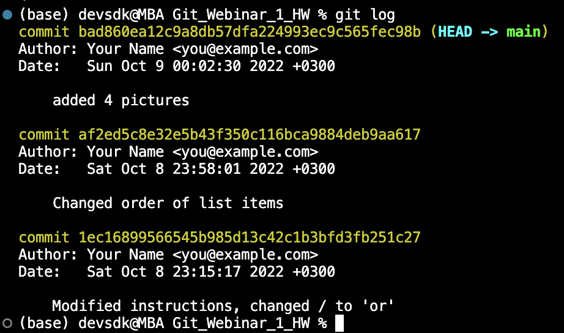

**Команды для работы с git**
> **Git** - утилита для отслеживания и ведения истории изменения файлов, содержащих текст. Можно вернуть проект до более старой версии, сравнивать, анализировать, сливать (merge) версии в репозитории. Репозиторий - это локальная папка проекта.

* Инициализация или создание репозитория: **git init**:

* Показывает состояния файлов в рабочем каталоге и индексе **git status**:

* Добавляем к отслеживаемым весь проект или отдельные файлы **git add**:

* Теперь создаем commit. Указываем комментарий. **git commit -m "<комментарий>"**:

* Смотрим разницу между проиндексированным и текущим
**git diff**:

* Перечисляет коммиты **git log**:

* Вывести все ветки на экран: **git branch**
* Создать новую ветку: **git branch branch_name**
* Сменить ветку: **git checkout branch_name**
* Слить ветки (в текущую ветку добавиться информаци из branch_name): **git merge branch_name**
* Удалить уже слитую ветку: **git branch: -d branch_name**
* Лог коммитов с визуализацией: **git log --graph**
* Создать локальную копию удалённого репозитория: **git clone**
* "Стянуть/выкачать" все изменения из удалённого репозитория: **git pull**
* Отправить изменения в удалённый репозиторий: **git push**

## Комментарии:
* **Git pull** выкачивает данные из удалённого репозиория и делает слияние с локальным репозиторием 
* Копия чужого репозитория называется fork
* **Git push** - git должен знать адрес удаленного репозитория, должен быть "авторизован" на внесение изменений в удалённом репозитории
*Конфликты при merge возникают когда одна и та же строка в разных ветках написана по-разному.
*Если нужно отменить merge, а commit ещё не был выполнен - **git merge --abort**
*Если пытаешься закоммитить с комментарием, но без парамтра -m, будет ошибка:

