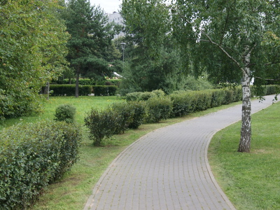

# Инструкция по работе с Git

## Базовые команды по работе с Git

*git init* - **Создание нового локального репозитория**

*git status* - **Команда для вывода статуса изменений**

*git add* - **Команда для добавления файла к коммиту**

*git commit -m "<message>"* - **Команда для создания коммита**

*git diff* - **Команда для вывода разницы между зафиксированнным и нынешним файлом**

*git log*- **Команда для вывода журнала изменений**

*git checkout <commit code>* - **Команда для перехода к коммиту по его хэш коду**

*git checkout master(main)* - **Команда для возврата на актуальное состояние**

Здесь была просто строка, теперь суперстрока!!!
*git merge <branch_name>* - **слияние веток между собой**

*git branch -d <branch_name>* - **удаление ветки**

*git branch -m <new_branch_name>* - **переименование ветки**

*git log --graph* - **Команда для вывода журнала изменений в графическом режиме**

prosto stroka

> This is a blockquote. Learning to quote

> This is the second quote. We continue to learn to quote

For more information, see the [microsoft learn](https://learn.microsoft.com/ru-ru/contribute/markdown-reference).

To learn GIT, follow the link [git education](https://habr.com/ru/post/541258/)

**Ниже будет контрольный список:**

 [div class="checklist"]
> * List item 1
> * List item 2
> * List item 3
> * List item 4
> * List item 5
> * List item 6

Какая-то ерунда с отображением класса

**Просто текст: непонятно почему сверху класс отображается, это нормально?**

**А тут повтор с другим именем**

