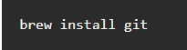
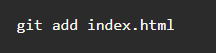

Для выполнения домашнего задания была взята информация с [сайта.](https://proglib.io/p/git-for-half-an-hour)

# Инструкция по работе с Git

## Установка
__Установить git на свою машину очень просто:__

* _Linux_ — нужно просто открыть терминал и установить приложение при помощи пакетного менеджера вашего дистрибутива. Для Ubuntu команда будет выглядеть следующим образом:

 

* _Windows_ — мы рекомендуем git for windows, так как он содержит и клиент с графическим интерфейсом, и эмулятор bash.

* _OS X_ — проще всего воспользоваться homebrew. После его установки запустите в терминале:

## Настройка
Итак, мы установили git, теперь нужно добавить немного настроек. Есть довольно много опций, с которыми можно играть, но мы настроим самые важные: наше имя пользователя и адрес электронной почты. Откройте терминал и запустите команды:

Теперь каждое наше действие будет отмечено именем и почтой. Таким образом, пользователи всегда будут в курсе, кто отвечает за какие изменения — это вносит порядок.
Git хранит весь пакет конфигураций в файле `.gitconfig`, находящемся в вашем локальном каталоге. Чтобы сделать эти настройки глобальными, то есть применимыми ко всем проектам, необходимо добавить флаг `–global`. Если вы этого не сделаете, они будут распространяться только на текущий репозиторий.
Для того, чтобы посмотреть все настройки системы, используйте команду:

Для удобства и легкости зрительного восприятия, некоторые группы команд в Гит можно выделить цветом, для этого нужно прописать в консоли:

Если вы не до конца настроили систему для работы, в начале своего пути - не беда. Git всегда подскажет разработчику, если тот запутался, например:

0. Команда `git --help` - выводит общую документацию по git
0. Если введем `git log --help` - он предоставит нам документацию по какой-то определенной команде (в данном случае это - log)
0. Если вы вдруг сделали опечатку - система подскажет вам нужную команду
0. После выполнения любой команды - отчитается о том, что вы натворили
0. Также Гит прогнозирует дальнейшие варианты развития событий и всегда направит разработчика, не знающего, куда двигаться дальше

Тут стоит отметить, что подсказывать система будет на английском, но не волнуйтесь, со временем вы изучите несложный алгоритм ее работы и будете разговаривать с ней на одном языке.

## Создание нового репозитория
Как мы отметили ранее, git хранит свои файлы и историю прямо в папке проекта. Чтобы создать новый репозиторий, нам нужно открыть терминал, зайти в папку нашего проекта и выполнить команду `init`. Это включит приложение в этой конкретной папке и создаст скрытую директорию .git, где будет храниться история репозитория и настройки.
Создайте на рабочем столе папку под названием git_exercise. Для этого в окне терминала введите:

Командная строка должна вернуть что-то вроде:

Это значит, что наш репозиторий был успешно создан, но пока что пуст. Теперь создайте текстовый файл под названием hello.txt и сохраните его в директории git_exercise.

## Определение состояния
`status` — это еще одна важнейшая команда, которая показывает информацию о текущем состоянии репозитория: актуальна ли информация на нём, нет ли чего-то нового, что поменялось, и так далее. Запуск `git status` на нашем свежесозданном репозитории должен выдать:

Сообщение говорит о том, что файл hello.txt неотслеживаемый. Это значит, что файл новый и система еще не знает, нужно ли следить за изменениями в файле или его можно просто игнорировать. Для того, чтобы начать отслеживать новый файл, нужно его специальным образом объявить.

## Подготовка файлов
В git есть концепция области подготовленных файлов. Можно представить ее как холст, на который наносят изменения, которые нужны в коммите. Сперва он пустой, но затем мы добавляем на него файлы (или части файлов, или даже одиночные строчки) командой add и, наконец, коммитим все нужное в репозиторий (создаем слепок нужного нам состояния) командой commit.
В нашем случае у нас только один файл, так что добавим его:

Если нам нужно добавить все, что находится в директории, мы можем использовать:

Проверим статус снова, на этот раз мы должны получить другой ответ:

Файл готов к коммиту. Сообщение о состоянии также говорит нам о том, какие изменения относительно файла были проведены в области подготовки — в данном случае это новый файл, но файлы могут быть модифицированы или удалены.

## Фиксация изменений
## Как сделать коммит 
Представим, что нам нужно добавить пару новых блоков в html-разметку (index.html). Для сохранения изменений, его необходимо закоммитить. Но сначала, мы должны обозначить этот файл для Гита, при помощи команды `git add`, добавляющей (или подготавливающей) его к коммиту:

Теперь создадим непосредственно сам коммит:

Флажок `-m` задаст commit message - комментарий разработчика. Он необходим для описания закоммиченных изменений. И здесь работает золотое правило всех комментариев в коде: «Максимально ясно, просто и содержательно обозначь написанное!»

## Как посмотреть коммиты
Для просмотра все выполненных фиксаций можно воспользоваться историей коммитов. Она содержит сведения о каждом проведенном коммите проекта. Запросить ее можно при помощи команды:

В ней содержиться вся информация о каждом отдельном коммите, с указанием его хэша, автора, списка изменений и даты, когда они были сделаны.

## Отслеживание изменений, сделанных в коммитах
У каждого коммита есть свой уникальный идентификатор в виде строки цифр и букв. Чтобы просмотреть список всех коммитов и их идентификаторов, можно использовать команду `log`:

Как вы можете заметить, идентификаторы довольно длинные, но для работы с ними не обязательно копировать их целиком — первых нескольких символов будет вполне достаточно. Чтобы посмотреть, что нового появилось в коммите, мы можем воспользоваться командой `show [commit]`

Чтобы увидеть разницу между двумя коммитами, используется команда `diff` (с указанием промежутка между коммитами):

 

Мы сравнили первый коммит с последним, чтобы увидеть все изменения, которые были когда-либо сделаны. Обычно проще использовать `git difftool`, так как эта команда запускает графический клиент, в котором наглядно сопоставляет все изменения.

## Возвращение файла к предыдущему состоянию
Гит позволяет вернуть выбранный файл к состоянию на момент определенного коммита. Это делается уже знакомой нам командой checkout, которую мы ранее использовали для переключения между ветками. Но она также может быть использована для переключения между коммитами (это довольно распространенная ситуация для Гита - использование одной команды для различных, на первый взгляд, слабо связанных задач).
В следующем примере мы возьмем файл hello.txt и откатим все изменения, совершенные над ним к первому коммиту. Чтобы сделать это, мы подставим в команду идентификатор нужного коммита, а также путь до файла:

## Ветвление
Во время разработки новой функциональности считается хорошей практикой работать с копией оригинального проекта, которую называют веткой. Ветви имеют свою собственную историю и изолированные друг от друга изменения до тех пор, пока вы не решаете слить изменения вместе. Это происходит по набору причин:

> Уже рабочая, стабильная версия кода сохраняется.

> Различные новые функции могут разрабатываться параллельно разными программистами.

> Разработчики могут работать с собственными ветками без риска, что кодовая база поменяется из-за чужих изменений.

> В случае сомнений, различные реализации одной и той же идеи могут быть разработаны в разных ветках и затем сравниваться.
## Создание новой ветки
Основная ветка в каждом репозитории называется master. Чтобы создать еще одну ветку, используем команду `branch <name>`

Это создаст новую ветку, пока что точную копию ветки master.

## Переключение между ветками
Сейчас, если мы запустим `branch`, мы увидим две доступные опции:

master — это активная ветка, она помечена звездочкой. Но мы хотим работать с нашей “новой потрясающей фичей”, так что нам понадобится переключиться на другую ветку. Для этого воспользуемся командой `checkout`, она принимает один параметр — имя ветки, на которую необходимо переключиться.

В Git ветка — это отдельная линия разработки. `Git checkout` позволяет нам переключаться как между удаленными, так и меду локальными ветками. Это один из способов получить доступ к работе коллеги или соавтора, обеспечивающий более высокую продуктивность совместной работы. Однако тут надо помнить, что пока вы не закомитили изменения, вы не сможете переключиться на другую ветку. В такой ситуации нужно либо сделать коммит, либо отложить его, при помощи команды `git stash`, добавляющей текущие незакоммиченные изменения в стек изменений и сбрасывающей рабочую копию до HEAD'а репозитория.

## Слияние веток
Наша “потрясающая новая фича” будет еще одним текстовым файлом под названием feature.txt. Мы создадим его, добавим и закоммитим:

Изменения завершены, теперь мы можем переключиться обратно на ветку master.

Теперь, если мы откроем наш проект в файловом менеджере, мы не увидим файла feature.txt, потому что мы переключились обратно на ветку master, в которой такого файла не существует. Чтобы он появился, нужно воспользоваться `merge` для объединения веток (применения изменений из ветки amazing_new_feature к основной версии проекта).

Теперь ветка master актуальна. Ветка amazing_new_feature больше не нужна, и ее можно удалить.

## Как удалять ветки в Git?
Бывают ситуации, когда после слива каких-то изменений из рабочей ветки в исходную версию проекта, ее, по правилам хорошего тона, необходимо удалить, чтобы она более не мешалась в вашем коде. Но как это сделать?
Для локально расположенных веток существует команда:

где флажок `-d` являющийся опцией команды `git branch` - это сокращенная версия ключевого слова `--delete`, предназначенного для удаления ветки, а `local_branch_name` – название ненужной нам ветки.
Однако тут есть нюанс: удалить текущую ветку, в которую вы, в данный момент просматриваете - нельзя. Если же вы все-таки попытаетесь это сделать, система отругает вас и выдаст ошибку с таким содержанием:

Так что при удалении ветвей, обязательно переключитесь на другой branch.

## Разрешение конфликтов при слиянии
Помимо сценария, описанного в предыдущем пункте, конфликты регулярно возникают при слиянии ветвей или при отправке чужого кода. Иногда конфликты исправляются автоматически, но обычно с этим приходится разбираться вручную — решать, какой код остается, а какой нужно удалить.
Давайте посмотрим на примеры, где мы попытаемся слить две ветки под названием john_branch и tim_branch. И Тим, и Джон правят один и тот же файл: функцию, которая отображает элементы массива.
Джон использует цикл:

Тим предпочитает forEach:

Они оба коммитят свой код в соответствующую ветку. Теперь, если они попытаются слить две ветки, они получат сообщение об ошибке:

Система не смогла разрешить конфликт автоматически, значит, это придется сделать разработчикам.Над разделителем ======= мы видим последний (HEAD) коммит, а под ним - конфликтующий. Таким образом, мы можем увидеть, чем они отличаются и решать, какая версия лучше. Или вовсе написать новую. В этой ситуации мы так и поступим, перепишем все, удалив разделители, и дадим git понять, что закончили.

Когда все готово, нужно закоммитить изменения, чтобы закончить процесс:

Как вы можете заметить, процесс довольно утомительный и может быть очень сложным в больших проектах. Многие разработчики предпочитают использовать для разрешения конфликтов клиенты с графическим интерфейсом. (Для запуска нужно набрать `git mergetool`).

## Удаленные репозитории
> Что такое удаленный репозиторий

Репозиторий, хранящийся в облаке, на стороннем сервисе, специально созданном для работы с git имеет ряд преимуществ. Во-первых - это своего рода резервная копия вашего проекта, предоставляющая возможность безболезненной работы в команде. А еще в таком репозитории можно пользоваться дополнительными возможностями хостинга. К примеру -визуализацией истории или возможностью разрабатывать вашу программу непосредственно в веб-интерфейсе.
> Клонирование

Клонирование - это когда вы копируете удаленный репозиторий к себе на локальный ПК. Это то, с чего обычно начинается любой проект. При этом вы переносите себе все файлы и папки проекта, а также всю его историю с момента его создания. Чтобы склонировать проект, сперва, необходимо узнать где он расположен и скопировать ссылку на него. В нашем руководстве мы будем использовать адрес https://github.com/tutorialzine/awesome-project, но вам посоветуем, попробовать создать свой репозиторий в GitHub, BitBucket или любом другом сервисе:

При клонировании в текущий каталог, там будет создана папка, в которую поместятся все проектные файлы и скрытая директория .git, с самим репозиторием, или с необходимой информацией о нем. В такой ситуации, для клонируемого репозитория, по умолчанию, будет создана папка с одноименным названием, но его можно залить и в другую директорию, например:

> Подключение к удаленному репозиторию

Чтобы загрузить что-нибудь в удаленный репозиторий, сначала нужно к нему подключиться. Регистрация и установка может занять время, но все подобные сервисы предоставляют хорошую документацию.
Чтобы связать наш локальный репозиторий с репозиторием на GitHub, выполним следующую команду в терминале. Обратите внимание, что нужно обязательно изменить URL репозитория на свой.

Проект может иметь несколько удаленных репозиториев одновременно. Чтобы их различать, мы дадим им разные имена. Обычно главный репозиторий называется origin.

> Отправка изменений на сервер

Сейчас самое время переслать наш локальный коммит на сервер. Этот процесс происходит каждый раз, когда мы хотим обновить данные в удаленном репозитории.
Команда, предназначенная для этого - `push`. Она принимает два параметра: имя удаленного репозитория (мы назвали наш origin) и ветку, в которую необходимо внести изменения (master — это ветка по умолчанию для всех репозиториев).

Эта команда немного похожа на `git fetch`, с той лишь разницей, что при помощи `fetch` мы импортируем коммиты в локальную ветку, а при применив `push`, мы экспортируем их из локальной в удаленную. Если вам необходимо настроить удаленную ветку используйте `git remote`. Однако пушить надо осторожно, ведь рассматриваемая команда перезаписывает безвозвратно все изменения. В большинстве случаев, ее используют, чтобы опубликовать выгружаемые локальные изменения в центральный репозиторий. А еще ее применяют для того, чтобы поделиться, внесенными в локальный репозиторий, нововведениями, с коллегами или другими удаленными участниками разработки проекта. Подытожив сказанное, можно назвать `git push` - командой выгрузки, а `git pull` и `git fetch` - командами загрузки или скачивания. После того как вы успешно запушили измененные данные, их необходимо внедрить или интегрировать, при помощи команды слияния `git merge`.
В зависимости от сервиса, который вы используете, вам может потребоваться аутентифицироваться, чтобы изменения отправились. Если все сделано правильно, то когда вы посмотрите в удаленный репозиторий при помощи браузера, вы увидите файл hello.txt

 >Запрос изменений с сервера

Если вы сделали изменения в вашем удаленном репозитории, другие пользователи могут скачать изменения при помощи команды` pull`.

